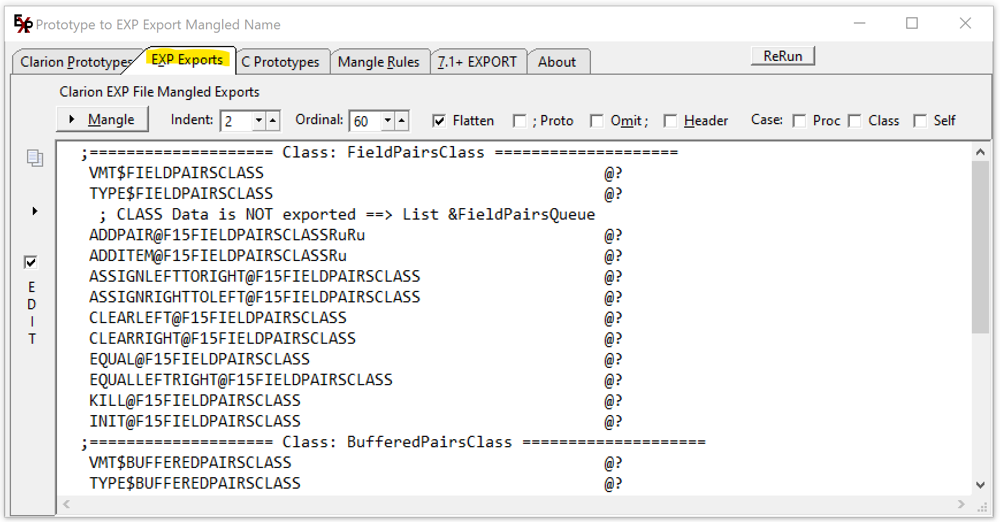

# Prototype2Export-Pro2Exp
 Prototype to Mangled Export for EXP file - Pro2Exp

Paste in Procedure Prototypes and click Mangle. The EXP Exports tab has the mangled lines.
 Based on work by Lee White and Jeff Slarve.

