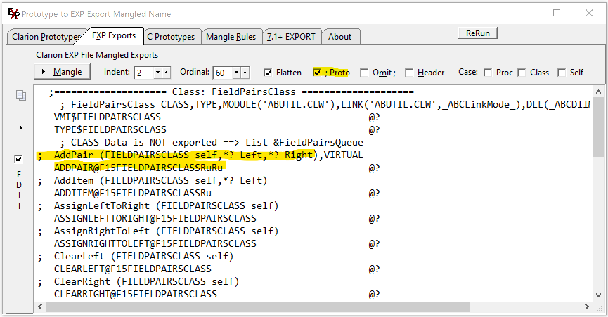

## Prototype2Export-Pro2Exp
 Prototype to Mangled Export for EXP file - Pro2Exp

Paste in Procedure Prototypes and click Mangle. The EXP Exports tab has the mangled lines.
 This is intended for Procedures but it will do Data. 
 For GROUP and QUEUE do not list the contained data declarions nor the END.
 TYPE data is never exported, it only appeears in INC files.
 
This is based on prior work by Lee White and Jeff Slarve. Thanks!

### Checkbox "; Proto"

Check the "; Proto" box to have comment lines inserted into the EXP showing the original Prototype.
 This makes it easy to see how various data types are mangled e.g. *? is Ru.
 All the types are listed on the "Mangle Rules" tab. 

---

### EXPORT Attribute on Data and Prototypes

Read the "7.1 EXPORT" tab and below blog for information on the new EXPORT declaration.

http://clarionsharp.com/blog/71-preliminary-release-notes-and-a-happy-thanksgiving

FEATURE: 
New attribute for procedure prototypes and static variables declarations: EXPORT.
 The EXPORT attribute forces the variable or procedure to be added to the export
 list of the DLL even if it is not listed in the EXPORTS section of the EXP file.

