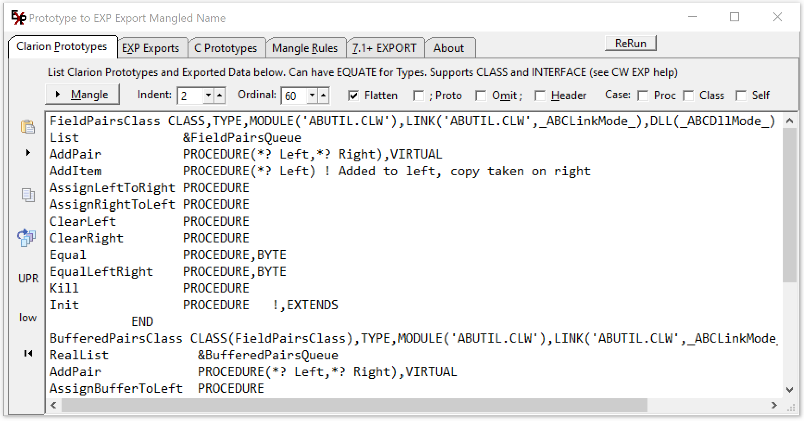
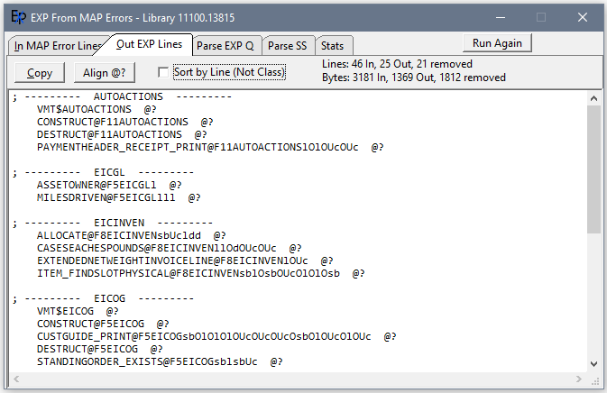

## Prototype2Export-Pro2Exp
 Prototype to Mangled Export for EXP file - Pro2Exp

Paste in Procedure Prototypes and click Mangle. The EXP Exports tab has the mangled lines.
 This is intended for Procedures but it will do Data.
 For GROUP and QUEUE do not list the contained data declarions nor the END.
 TYPE data is never exported, it only appeears in INC files.

This is based on prior work by Lee White and Jeff Slarve. Thanks!

### Checkbox "; Proto"

Check the "; Proto" box to have comment lines inserted into the EXP showing the original Prototype.
 This makes it easy to see how various data types are mangled e.g. *? is Ru.
 All the types are listed on the "Mangle Rules" tab.

---

### EXPORT Attribute on Data and Prototypes

Read the "7.1 EXPORT" tab and below blog for information on the new EXPORT declaration.

http://clarionsharp.com/blog/71-preliminary-release-notes-and-a-happy-thanksgiving

FEATURE:
New attribute for procedure prototypes and static variables declarations: EXPORT.
 The EXPORT attribute forces the variable or procedure to be added to the export
 list of the DLL even if it is not listed in the EXPORTS section of the EXP file.

---

## EXPfromErrors - New Utility July 2022

One technique for creating the EXP file import lines is to prototype the external functions in the importing APP then build and that will throw “Unresolved External” errors. Those errors contain the mangled name needed for the EXP. Click on one error line and the MAP file opens with all the errors.

Paste those lines into this EXPfromErrors utility and click Parse Symbols.

It will parse them into mangled export Lines you can put into your EXP file. The tool tries to group them by Class or logically. You can uncheck Sort and they will be in the original order. Click the Copy button then paste that into your EXP.

The “Parse EXP Q” tab shows the exports in a list that is sortable by clicking on the columns.

You can also paste in an EXP and process it by checking the “Input is EXP”.  The main benefit is it will sort the EXP by class and also allow viewing it in a LIST. The statistics tab will show symbol sizes which I use to write utilities.

